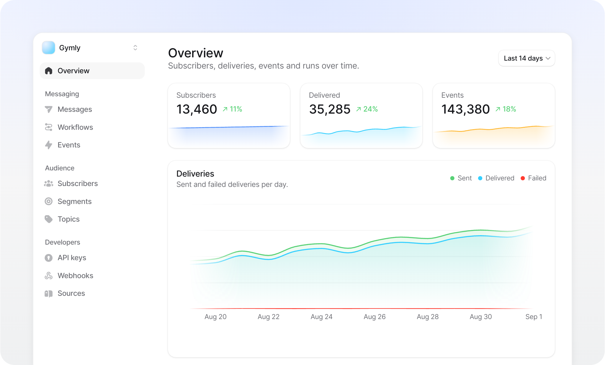

<!-- Header -->
<div align="center">
  <a href="https://buzzkit.dev">
    
  </a>

  <h3 align="center">BuzzKit</h3>
  <b>The Open Source Notification Orchestration Layer</b>
</div>

<!-- TOC -->
<p align="center">
    <a href="https://buzzkit.dev"><strong>Learn more »</strong></a>
    <br />
    <br />
    <a href="#introduction">Introduction</a>
    ·
    <a href="#self-hosting">Self-Hosting</a>
    ·
    <a href="#development">Development</a>
    ·
    <a href="#roadmap">Roadmap</a>
    ·
    <a href="#contributing">Contributing</a>
</p>

<p>
    <a href="https://buzzkit.dev">
      
    </a>
</p>

## Introduction

BuzzKit is an open source orchestration layer for notifications. You bring the keys for your providers, and BuzzKit gives you subscriber management, targeting, preferences, scheduling, workflows, retries and delivery receipts through one API and one dashboard.

It is designed to be integrated once and driven by events from then on. The SDK keeps users and devices in sync, your app and backend report what happened, and workflows decide what to send and when. BuzzKit supports iOS push today, with Android, email and SMS planned as connectors on the same multi-channel core.

Use BuzzKit at [buzzkit.dev](https://buzzkit.dev) or self-host the same code. Guides and the complete API reference are available in the [documentation](https://docs.buzzkit.dev).

## Self-Hosting

A complete self-hosting guide is coming soon. For now, deployments require a Cloudflare account for Workers, KV, Queues, Durable Objects and Hyperdrive, together with PostgreSQL and Tinybird. We plan to simplify this setup in future releases.

## Development

You need [Bun](https://bun.sh) and Docker.

```sh
bun install

bun db:up

cp apps/api/.dev.vars.example apps/api/.dev.vars
cp apps/web/.dev.vars.example apps/web/.dev.vars

bun run --cwd packages/database db:migrate
bun run --cwd packages/tinybird push

bun dev
```

`bun db:up` starts PostgreSQL and Tinybird Local in Docker. Before the first start, set `BETTER_AUTH_SECRET`, `CREDENTIAL_MASTER_KEY_V1` and `SQIDS_ALPHABET` in the API's `.dev.vars`; the example file explains how to generate each value. Run the Tinybird push once for every fresh container to load its event tables and endpoints.

| App | Address |
| --- | --- |
| API | http://localhost:8790, with the OpenAPI reference at `/swagger` |
| Dashboard | http://localhost:5180 |
| Marketing | http://localhost:5181 |
| Docs | http://localhost:5182 |

```
apps/
├── api/            The API, a Cloudflare Worker
├── web/            The dashboard
├── marketing/      buzzkit.dev
└── docs/           docs.buzzkit.dev

packages/
├── buzzkit/        The server SDK
├── schema/         The grammars the API and the dashboard both validate: workflows, sources, imports
├── database/       Drizzle schema and migrations
├── auth/           BetterAuth configuration
├── eden/           The typed API client the dashboard uses
├── observability/  Logging and tracing
├── tinybird/       The event stream as code
└── ui/             The design system
```

The iOS SDK lives in its own repository: [buzzkit-dev/buzzkit-ios](https://github.com/buzzkit-dev/buzzkit-ios).

| Command | Description |
| --- | --- |
| `bun dev` | Start every app |
| `bun run test` | Run the unit suites; from `apps/api`, the same command runs the integration suite with its own server |
| `bun lint` | Biome plus the repository's conventions checker |
| `bun check-types` | TypeScript across every package |
| `bun format:fix` | Format |

## Roadmap

BuzzKit supports iOS push today. Other channels will arrive as connectors that share the same subscribers, segments, topics and workflows:

- [ ] Android SDK and sending through FCM
- [ ] Email, through your own sending provider
- [ ] SMS
- [ ] Web push
- [ ] In-app messaging
- [ ] Experiments: A/B tests on messages and workflow steps

## Contributing

BuzzKit is still in beta, so we're being careful about what goes in. While that's the case, pull requests are limited to the core contributors, and the best way to help is through issues. Bug reports and feature ideas are always welcome, and we read every one.

- [Report a bug](https://github.com/buzzkit-dev/buzzkit/issues/new?labels=bug)
- [Propose a feature](https://github.com/buzzkit-dev/buzzkit/issues/new?labels=enhancement)

## License

The core is licensed under the [GNU Affero General Public License Version 3 (AGPLv3)](LICENSE).
